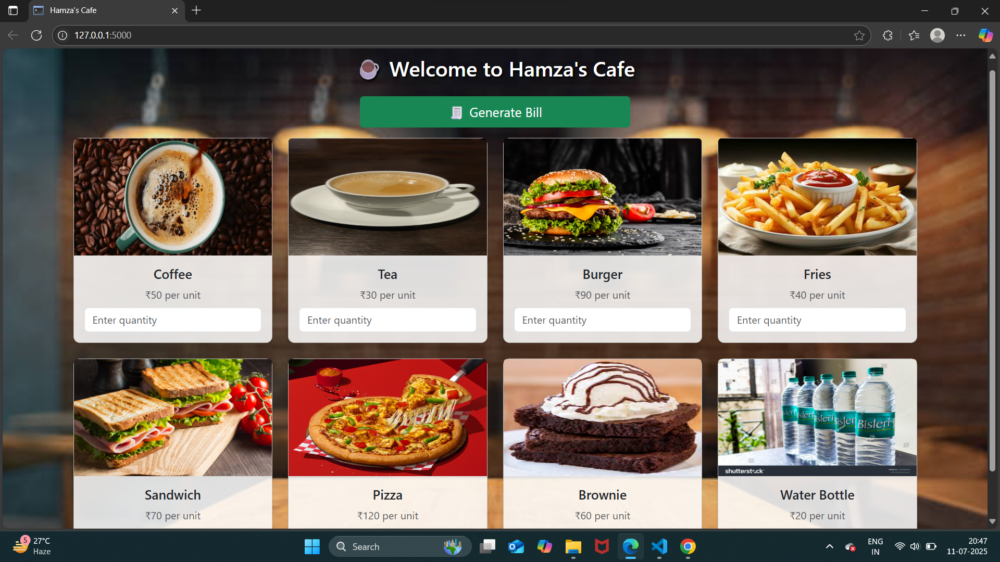
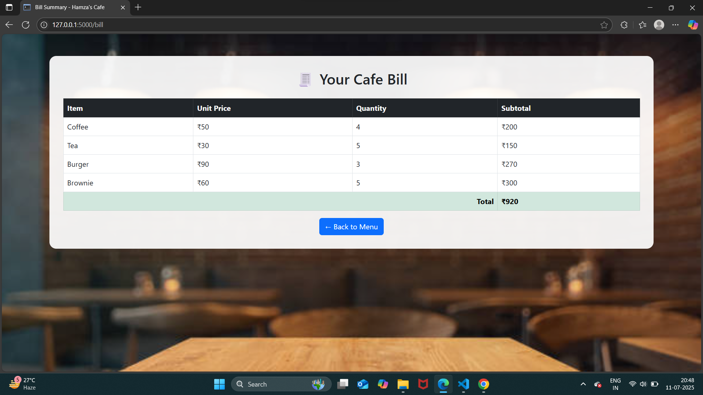

# ☕ Cafe Management System – Flask Project

A web-based billing system for a cafe, built using **Flask** and **Python**, where customers can select food items, enter quantities, and generate a real-time bill. It features a clean user interface with Bootstrap, image-based menu cards, and a cafe-themed background.

---

## 📌 Features

- 📸 Item cards with real food images (coffee, burger, etc.)
- 🔢 Quantity input per item
- 🧾 Auto-generated bill with subtotal & total
- 🎨 Modern UI with Bootstrap and cafe interior background
- 🧠 Python backend with Flask and Jinja2 templating

---

## 🛠 Tech Stack

- **Frontend:** HTML5, CSS3, Bootstrap
- **Backend:** Python, Flask, Jinja2
- **Tools:** GitHub, VS Code
- **Others:** Static folder (images), Templates (HTML pages)

---

## 📸 Screenshots

| Menu Page | Bill Page |
|-----------|-----------|
|  |  |

> Save your own screenshots as `menu_demo.png` and `bill_demo.png` inside the `static/images/` folder

---

## 🚀 How to Run This Project

1. **Clone the Repository**
   ```bash
   git clone https://github.com/yourusername/Cafe-Management-System-Flask.git
2. Navigate into the Project Folder
   cd Cafe-Management-System-Flask
3. Install Flask (if not installed)
   pip install flask
4. Run the App
5. Open your browser and go to
👉 http://127.0.0.1:5000/
